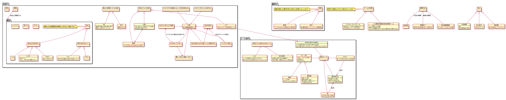
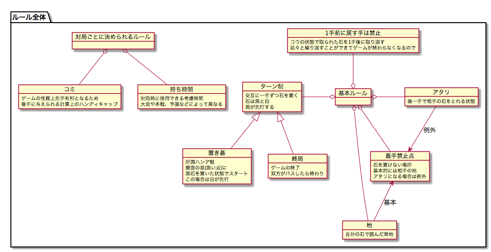

# 囲碁の理解についてのモデリング

囲碁について勉強中の作者が、囲碁の関連知識についてその理解をモデリングしてみます。

理解についてのご指摘はいつでも歓迎です。プルリク送ってくれると助かります。

## 全体像(最新)

以下の図は最新の状態です。

## ルール

ルールについて絞り込んだ図はこちら。

## 対局時の心得

東大教養囲碁講座から抜粋した対局時の心得をモデリングした図はこちら。

